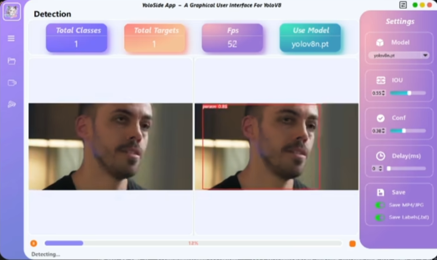

# 基于QT6的目标检测推理应用
## 1.项目简介
基于Qt6开发的应用程序，集成多种目标检测算法。支持YOLOv8/YOLOv11闭集检测和Grounding DINO开集检测，提供PyTorch、ONNXRuntime和OpenVINO三种推理方式，满足不同场景下的高效推理需求。

## 2.GUI演示视频


## 3.检测效果展示


## 4.性能指标对比(GPU:TRX4060Ti，CPU：i5-13600kf)
**YOLOV8/YOLOV11-GPU：**
| 模型名称	| Pytorch(FPS) | ONNX Runtime(FPS)|
|:---------:|:---------:|:---------:|
| YOLOv8n	| 53.8	    |67.3        |
| YOLOv8l	| 34.3      |48.7        |
| YOLOv11n	| 56.5      |69.1        |
| YOLOv11l	| 35.6      |49.3        | 

**YOLOV8/YOLOV11-CPU：**
| 模型名称	 | Pytorch(FPS) | ONNX Runtime(FPS) |OpenVINO(FPS)|
|:---------:|:---------:|:---------:|:---------:|
| YOLOv8n	| 29.5	    |45.3       |	50.2    |
| YOLOv8l	| 13.8	    |32.1       | 	38.2    |
| YOLOv11n	| 30.7	    |47.1       |	52.2    |
| YOLOv11l	| 14.2	    |34.5       | 	37.8    |

**Grounding DINO-GPU：**
| 模型名称	| Pytorch(FPS) | ONNX Runtime(FPS)|
|:---------:|:---------:|:---------:|
| Grounding DINO tiny	| 19.2      |24.8        |
| Grounding DINO base	| 11.5	    |20.1        |

**Grounding DINO-CPU：**
| 模型名称	 | Pytorch(FPS) | ONNX Runtime(FPS) |OpenVINO(FPS)|
|:---------:|:---------:|:---------:|:---------:|
| Grounding DINO tiny	| 8.7	    |15.7        |	17.1	|
| Grounding DINO base	| 5.2	    |10.3        | 	15.5    |


## 5.安装
- 0.基础需求(推荐)
  - 系统：`Windows 10` / `Ubuntu 18.04 LTS`	
  - NVIDIA驱动：`500.00.01` 或 更高
  - CUDA Toolkit:	`11.8` 或 `12.1`
  - Anaconda: `Anaconda3 2023.02`
  - python: `python>=3.8` 
- 1.下载
```bash
git clone https://github.com/your-username/your-project-name.git
cd your-project-name
```
- 2.安装依赖
```bash
pip install -r requirements.txt
```
- 3.运行
```bash
python ./main.py
```
## 6.参考
- [PyQt5-YOLOv5](https://github.com/Javacr/PyQt5-YOLOv5)
- [ultralytics](https://github.com/ultralytics/ultralytics)
## 7.许可证
- 本项目采用`AGPL-3.0`，许可证的详细信息参考`LICENSE`文件.

## 8.贡献
- 欢迎提交 Issue 和 Pull Request！
